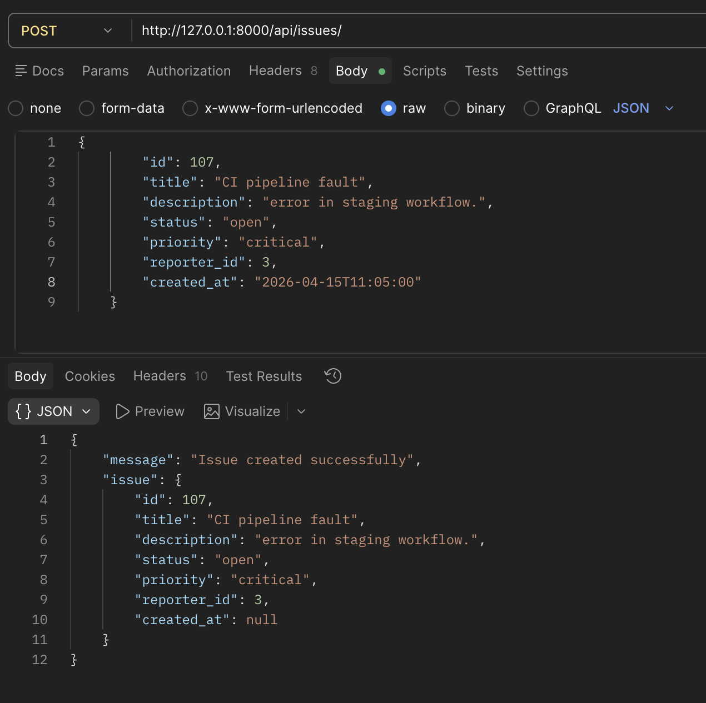
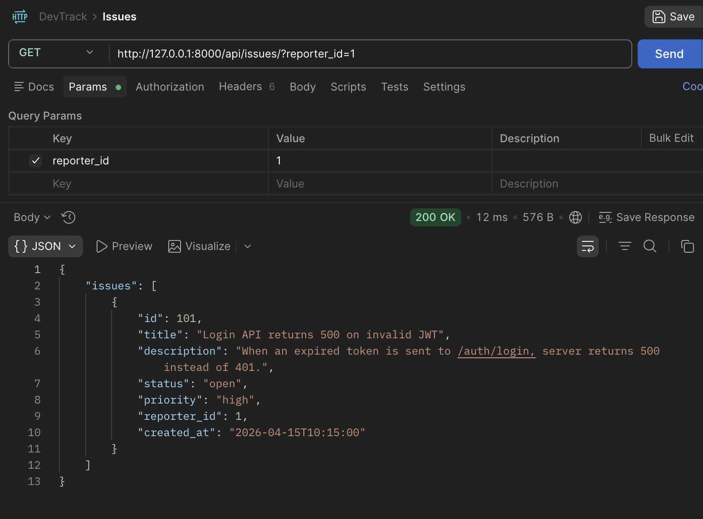
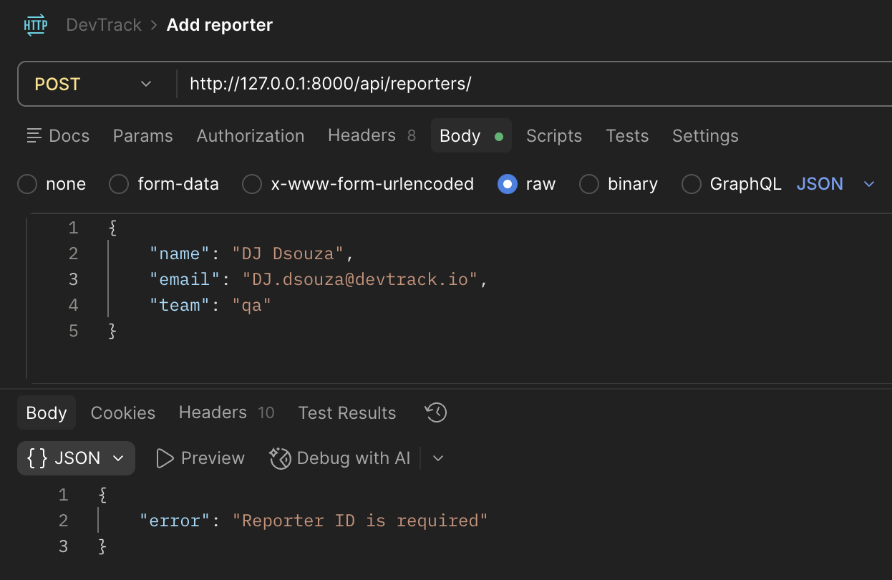
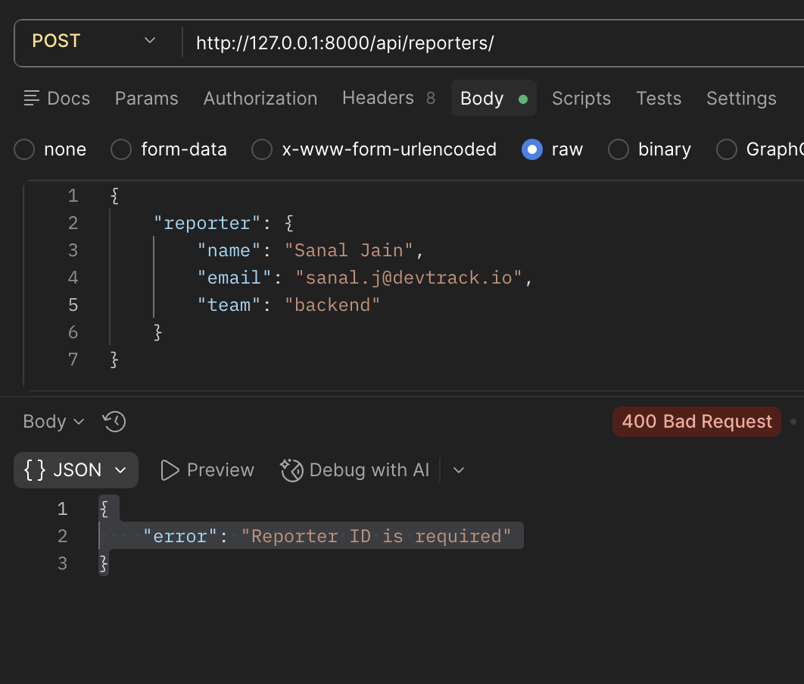
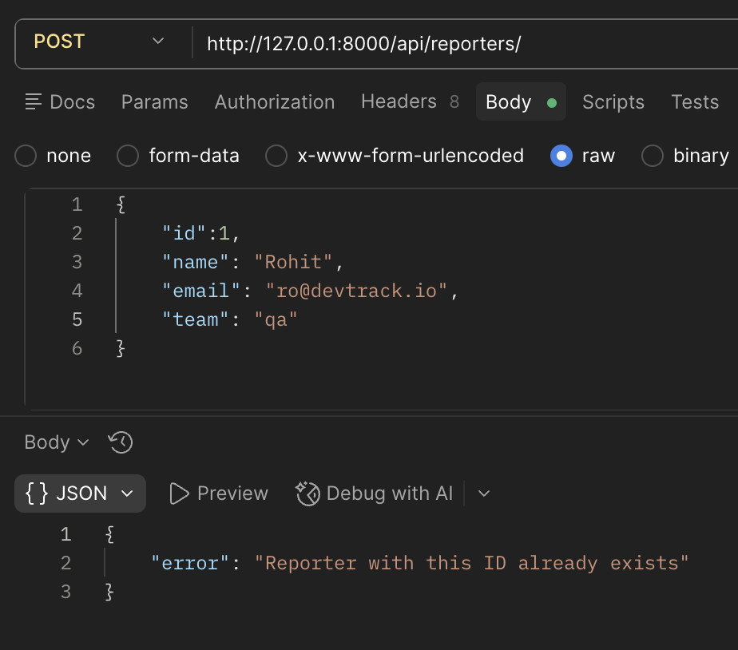

# DevTrack

A minimal backend API for tracking engineering issues (a stripped-down GitHub Issues).

**1. Project Overview**
- Simple Django + DRF-style API that stores data in JSON files under the `devtrack/` package for this exercise.
- Purpose: demonstrate OOP-first modeling of entities, simple HTTP endpoints, and basic validation.

**2. Entities**
- `Reporter`:
  - Fields: `id` (int), `name` (string), `email` (string), `team` (string)
  - Validation: `name`, valid `email` (contains `@`), non-empty `team`
- `Issue`:
  - Fields: `id` (int), `title` (string), `description` (string), `status` (one of `open`, `in_progress`, `resolved`, `closed`), `priority` (one of `low`, `medium`, `high`, `critical`), `reporter_id` (int), `created_at` (optional string)
  - Relationship: one `Reporter` can file many `Issue` records. `reporter_id` stored on `Issue`.
  - Validation: non-empty `title`; `status` and `priority` must be allowed values; `reporter_id` required when creating an Issue.

**3. Endpoints**
- `POST /api/reporters/` — Create a reporter
   ```JSON
    { 
        "id": 5, 
        "name": "DJ Dsouza", 
        "email": "dj@devtrack.io", 
        "team": "qa" 
    }
    ```
 - `GET /api/reporters/list/` — List all reporters
 - `GET /api/reporters/?id=<id>` — Get a single reporter by numeric `id` (returns 404 if not found)

- `POST /api/issues/` — Create an issue
  ```JSON
    { 
        "id": 201, 
        "title": "...", 
        "description": "...", 
        "status": "open", 
        "priority": "high", 
        "reporter_id": 1 
    }
    ```
 - `GET /api/issues/list/` — List all issues
 - `GET /api/issues/?id=<id>` — Get a single issue by numeric `id` (returns 404 if not found)
 - `GET /api/issues/?status=<status>` — Filter issues by `status` (case-insensitive)
 - `GET /api/issues/?reporter_id=<id>` - Filter issues created by specific reporter using reporter_id

**Design decision — reporter-scoped API**
- **Decision:** Provide a dedicated RESTful route for fetching issues created by a specific reporter, while keeping the existing `?reporter_id=` query filter for backwards compatibility.
- **Endpoint:** `GET /api/reporters/<id>/issues/` — returns all issues where `reporter_id == <id>`.
- **Rationale:** Expresses the relationship in the URL, improves discoverability for clients, and aligns with common REST practices. The query parameter `?reporter_id=` remains supported as a convenient filter.

Example:

```bash
curl "http://127.0.0.1:8000/api/reporters/1/issues/"
```


**4. Install & Run (on another machine)**
1. Clone the repo and go to the project folder (where `manage.py` lives):

```zsh
cd "<your-path>/Project_DevTrack"
```

2. Create and activate a Python virtual environment, install dependencies:

```zsh
python3 -m venv .venv
source .venv/bin/activate
python -m pip install --upgrade pip
python -m pip install -r requirements.txt
```

3. Run the server:

```zsh
source .venv/bin/activate
python manage.py runserver
```

4. The API base URL is `http://127.0.0.1:8000/api/`.

**5. Add / Create Reporter and Issue using Postman**

Some examples:

1. Create Issue:
    

2. Issue reported by reporter using reporter_id:
   

3. Create Reporter
   

4. Mandate reporter_id while creating reporter
   

5. Reporter with same ID cant created
   

---
Repository layout (relevant files):

```
Project_DevTrack/
  manage.py
  devtrack/
    settings.py
    urls.py
    reporters.json
    issues.json
    issues/
      __init__.py
      models.py
      views.py
      urls.py
```
